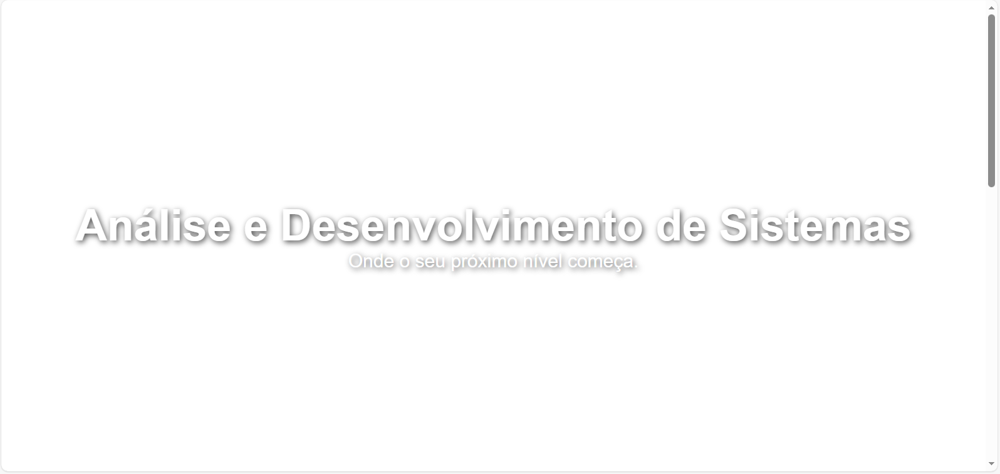

# 🚀 Master Class: Landing Page Premium com UI/UX Imersivo



> "Do Técnico ao Superior: Construindo experiências digitais, não apenas sites."


## 💻 Sobre o Projeto

Este projeto foi desenvolvido durante a **Master Class de Tecnologia**, focada em demonstrar a ponte entre o conhecimento técnico base e a engenharia de software avançada ensinada no curso superior de **Análise e Desenvolvimento de Sistemas (ADS)**.

O objetivo foi transformar uma página simples em uma **Experiência Premium** em menos de 2 horas, utilizando conceitos modernos de Front-End sem depender de frameworks pesados.

### 🎯 O que construímos?
Uma Landing Page para o curso de ADS que utiliza:
- **Efeito Parallax** (Profundidade 3D com CSS Puro).
- **Micro-interações** e Animações ao Scroll (Scroll-Triggered Animations).
- **Performance Nativa** usando a `IntersectionObserver API` do JavaScript.

---

## 🛠 Tecnologias & Conceitos (A "Oficina")

Aqui não apenas escrevemos código, nós aplicamos engenharia:

| Componente | Tecnologia | Conceito de ADS Aplicado |
| :--- | :--- | :--- |
| **O Chassi** | HTML5 Semântico | Estrutura de dados e SEO. |
| **A Pintura** | CSS3 (Flexbox/Grid) | Design Systems e UI (User Interface). |
| **O Motor** | JavaScript (ES6+) | Lógica de Programação e Manipulação do DOM. |
| **O Turbo** | Intersection Observer | Otimização de Performance e APIs de Navegador. |

---

## 📂 Estrutura do Projeto

```bash
/projeto-ads
│
├── index.html      # A estrutura semântica (O Chassi)
├── style.css       # O design e efeitos visuais (A Pintura)
└── script.js       # A lógica de animação (O Motor V8)

